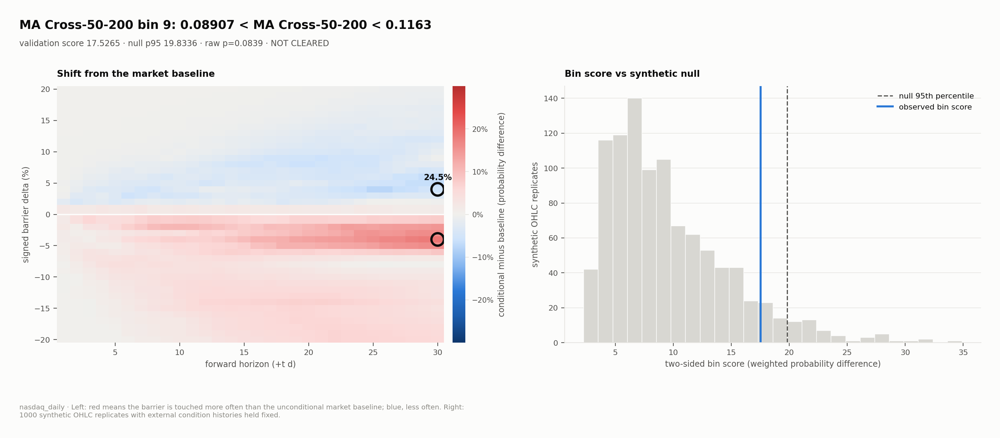
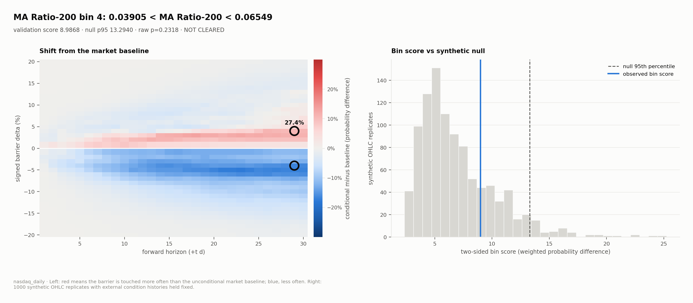
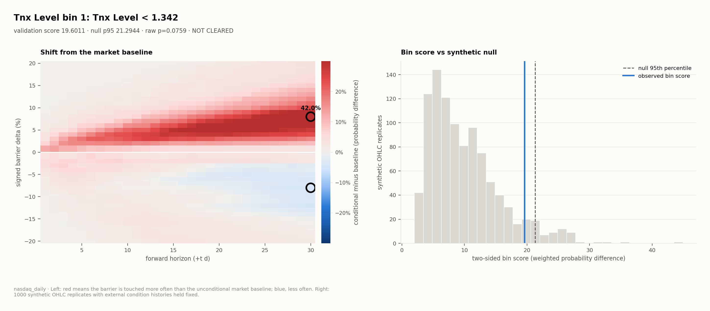
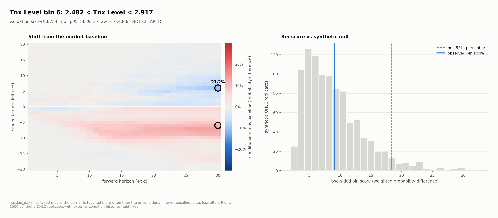

<div align="center">
  <h1><strong>AlphaVerify</strong> - Multi-Asset Financial Strategy Debunker</h1>
  
  <br><br>
  = 3.12">
  = 12.0">
  <br><br>  
  <pre><code>pip install -e .</code></pre>
</div>

**The chart found an edge. We asked whether chance could draw it too.**

You've seen lots of them: a so-called “alpha” strategy and an equity curve that claims to beat the market. They explain the setup, promise there is no future leak, and show that it earns money.

**Most “technical” indicators are essentially astrology with better charts.**

 AlphaVerify is built to put an end to all that bullshit.

<p align="center">
<table>
  <tr>
    <td align="center" width="33%"><h2>1,000</h2>synthetic OHLC histories</td>
    <td align="center" width="33%"><h2>552</h2>condition bins across 57 NASDAQ features</td>
    <td align="center" width="33%"><h2>4.5%</h2>only 25 bins cleared</td>
  </tr>
</table>
<br>
</p>

## Example - NASDAQ daily

Each figure shows one condition bin, such as "the 50-day average is 9% to 12% above the 200-day". The left panel shows how often the NASDAQ touches each barrier (±1% to ±20%) within 1 to 30 days while the condition holds, compared with all days. The circled cells are the mirror pair with the largest up/down contrast. The right panel places the bin's score among the scores of 1,000 synthetic price histories that share the market's volatility but contain no real signal. A bin clears only if its score beats the null's 95th percentile.

### MA Cross 50/200 bin 9 - the golden cross

The classic 50/200 moving-average cross, with the fast average 8.9% to 11.6% above the slow one, shows a coherent **24.5-point** contrast at ±4%. Its score still falls short of the null's 95th percentile (p = 0.084).

<p align="center">
  <a href="docs/bin_figure__ma_cross_50_200__bin_09.png"></a>
</p>

### MA Ratio-200 bin 4 - a textbook mirror

With price 3.9% to 6.5% above its 200-day average, the surface is almost a perfect mirror: red above zero and blue below, with a **27.4-point** contrast at ±4%. Chance produces it easily (p = 0.23).

<p align="center">
  <a href="docs/bin_figure__ma_ratio_200__bin_04.png"></a>
</p>

### TNX Level bin 1 - the 42-point edge

When the 10-year Treasury yield sat below 1.34%, the NASDAQ was **37.7 points** more likely than usual to rise 8% within 30 days, and 4.3 points less likely to fall 8%. That is a **42-point** gap between the two sides, and it grows steadily with the horizon. It looks like a macro regime you could trade.

<p align="center">
  <a href="docs/bin_figure__tnx_level__bin_01.png"></a>
</p>

It does not clear. Random histories produce a score at least this large 7.6% of the time.

### TNX Level bin 6 - same feature, opposite story

With the yield between 2.48% and 2.92%, the picture flips: an 8-to-10% drop becomes more likely and a rise less likely, for a **21.2-point** gap. Read by itself, it looks like a second, bearish regime. The score sits near the middle of the null (p = 0.41).

<p align="center">
  <a href="docs/bin_figure__tnx_level__bin_06.png"></a>
</p>

### The whole universe

None of the four clears. Across all 552 bins, 25 pass the raw 5% test, while pure chance would pass about 27.6. After the Benjamini-Hochberg correction for testing 552 bins at once, the smallest q-value is 0.55. On this data, the edges that look strongest cannot be told apart from noise.

## Try it

Run commands from the repository root. 

The distribution, CLI, and Python package are named `alphaverify`.
The repository name remains `alpha-verify`. Reinstall the editable package
after updating an existing checkout.

```
python -m pip install -e .

alphaverify measure
alphaverify compare
alphaverify validate
alphaverify select
alphaverify forecast
```

Each pipeline command also accepts `--cuda` when a CUDA-capable PyTorch installation and device are available.

## How it works

| Stage | CLI Command | What it does | Mathematical form |
|---|---|---|---|
| 1 | measure | Measure conditional probabilities | `π_condition(r, δ, k, t)` |
| 2 | compare | Compare them with the baseline | `G = π_condition − π_baseline` |
| 3 | validate | Validate every supported bin against the null | `p̂_k < 0.05 or p̂_k ≥ 0.05` |
| 4 | select | Retain cleared bins, rank them by evidence, and render their figures | `K_selected = {k : p̂_k < 0.05}` |
| 5 | forecast | List which nodes cleared and with which bins; combine those active on the last stored bar, one per family, and compare with their historical joint rate | `N_cleared = {node(k) : k ∈ K_selected}`; `logit P = logit π_baseline + Σ_k (logit π_k − logit π_baseline)` |


Validation writes `03_validation/`; selection consumes only a current validation result and writes `04_selection/`; the forecast consumes only a current selection and writes `05_forecast/`. Every cleared bin is retained—there is no top-k ranking or secondary economic gate.

## Repository map

- [Source architecture](src/alphaverify/README.md) — implementation boundaries, data flow, artifact contracts, and null mechanics.
- [Workspaces](workspaces/README.md) — experiment declarations, plugins, generated artifacts, and safe workspace changes.

AlphaVerify is research software, not investment advice.

The complete numerical specification is available as LaTeX in
[`mathematics.tex`](mathematics.tex).
