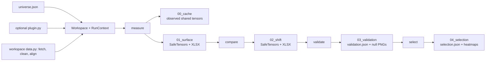

# Source architecture

`src/` owns the installable `alphaverify` package: numerical definitions, data and artifact adapters, pipeline orchestration, presentation, and the command-line entrypoint. It does not own asset-specific experiments—the declarations and optional extensions for those live in [`workspaces/`](../workspaces/README.md)—or the evidence narrative in the [root README](../README.md).

## Public entrypoints

| Entrypoint | Responsibility |
|---|---|
| `alphaverify.cli:main` | Installed `alphaverify` command and argument routing |
| `alphaverify.infrastructure.workspace.Workspace` | Validated view of one `universe.json` and its artifact namespace |
| `alphaverify.pipeline.step_01_surface.cmd_surface` | Stage 1 `measure` implementation |
| `alphaverify.pipeline.step_02_shift.cmd_shift` | Stage 2 `compare` implementation |
| `alphaverify.pipeline.step_03_validation.cmd_validation` | Stage 3 `validate` implementation |
| `alphaverify.pipeline.step_04_selection.cmd_selection` | Stage 4 `select` implementation |
| `alphaverify.pipeline.status.cmd_status` | Read-only workspace and node inspection |

The CLI constructs `Workspace(args.workspace)` relative to `Path.cwd() / "workspaces"`; run it from the repository root unless calling the Python API with an explicit workspace directory.

## Package boundaries

```text
src/alphaverify/
  cli.py              command definitions and dispatch
  domain/             numerical and statistical rules
  infrastructure/     workspace, source, plugin, and persistence adapters
  pipeline/           stage orchestration and status reporting
  presentation/       XLSX and PNG views of existing artifacts
```

### `domain/`

Owns barrier-touch calculations, feature transforms, baseline subtraction, bin scoring, synthetic-null generation, and CPU/CUDA tensor selection. Domain code must not own persistence, CLI behavior, pipeline orchestration, or presentation. Tests enforce that it has no outward dependency on the other package layers.

Key modules:

- `barrier.py` owns `measure_histories()`: quantile edges, the shared incremental excursion ladder, conditional probabilities, counts, and each history's baseline. Stage 1 collects its horizon slices into cubes. It also owns `ohlcv_array()`, the canonical OHLCV order with the legacy fallback for histories lacking open or volume, and `observed_outcomes()`, the per-history excursions, touch matrix, and baseline that Stage 1 and Stage 3 reuse.
- `features.py` registers built-in features and routes core transforms to `torch_features.py`.
- `shift.py` defines the Stage 2 probability-difference shift and the practical-effect inspection used by node status.
- `scoring.py` owns baseline subtraction, cell eligibility, barrier weights, and the full-grid bin score; cell contributions are private to the bin scorer.
- `validation.py` fits and samples the synthetic OHLC null. Its `score_histories()` measures and scores both the observed batch of one and simulated batches through the same path.
- `tensor_runtime.py` owns the selected Torch device; the CLI calls `tensor_runtime.configure()` before a stage runs.

### `infrastructure/`

Owns artifact persistence, workspace declarations, prepared-data validation, and loading workspace-local code. Provider access and cleaning policy belong to the workspace.

- `workspace.py` loads `universe.json` once into `NodeCatalog` and immutable `WorkspaceConfig` objects, and defines every path below the workspace: stage directories, `00_data/`, and `00_cache/`.
- `market_data.py` lazily loads the workspace's `data.py`, validates prepared panels, and caches them per command. It never chooses a provider, sorts, fills, joins, or drops rows. New inputs require finite positive OHLC, finite nonnegative volume, valid OHLC ordering, and unique increasing timezone-naive timestamps. Auxiliary values may be NaN, but not infinite.
- `workspace_plugins.py` loads `data.py` and the optional feature-only `plugin.py`, whose entry point is `register(features)`. Modules can import helpers relative to their workspace; namespaces are isolated by absolute workspace root.
- `artifact_io.py` is the sole persistence owner. It writes SafeTensors plus JSON metadata, restores probability-like arrays as float64 for runtime calculations, reads and writes JSON summaries, and computes the `file_sha256()` fingerprints that tie derived artifacts to their inputs.
- `artifact_history.py` reconstructs aligned OHLCV and feature histories from stage artifacts and computes a history's content key.

### `pipeline/`

Owns sequencing, progress reporting, failure isolation by node, timestamps, provenance metadata, and the transition between domain operations and persisted artifacts. A pipeline module may use domain, infrastructure, and presentation APIs. It should not redefine their calculations or schemas.

`RunContext` creates a fresh workspace data boundary and feature registry for one command, loads optional feature registrations, caches prepared panels, and persists and reuses each history's observed outcomes (calculated by `barrier.observed_outcomes()`). Data code is loaded only when measurement requests inputs; validation from stored artifacts does not load providers. Stored history is validated without silently dropping rows; legacy histories may omit open and volume.

`domain/notation.py` is the code-level notation contract. It names canonical
tensor axes, fixes the OHLCV component order, and provides typed measurement
and scoring results. Public numerical boundaries use descriptive ASCII names;
short symbols are confined to `mathematics.tex`.

### `presentation/`

Owns human-readable workbooks and plots. It consumes artifact data and may use domain helpers, but must not invoke pipeline commands or depend on the CLI. Presentation files are derived views; arrays and JSON remain the machine-readable contract. `display.py` holds the conventions both views share: node display names and the shift color-scale limit.

## Data and artifact flow



Stages are restartable but ordered. A missing prerequisite produces a compact report rather than synthesizing upstream data.

### Stage 1: `measure`

For every declared node, load its requested data sources, compute the feature, create quantile bins, and calculate:

```text
conditional_probability[barrier, bin, horizon]
```

The SafeTensors cube includes probabilities, hit counts, bin counts, barrier and horizon axes, bin edges, bin assignments, metadata, and the ordered market/feature history needed downstream. A versioned `00_cache` artifact stores each unique market history's float64 forward excursions, shared boolean touch matrix, and unconditional baseline.

### Stage 2: `compare`

Subtract the baseline for the same signed barrier and horizon:

```text
probability_shift[barrier, bin, horizon]
    = conditional_probability − baseline_probability
```

The stored unit is a probability difference in [-1, 1]; 0.10 displays as +10%, a 10-percentage-point difference. Scores use weighted probability differences and are not percentages. Stage 2 owns only the derived shift tensor and fingerprints/references its node and baseline Stage 1 artifacts. Readers materialize the remaining arrays from Stage 1, avoiding a second copy of every probability cube and history.

### Stage 3: `validate`

Validation tests every eligible bin of every available non-baseline node from `02_shift`. There is no preselection, top-k filter, rank, or representative cell before validation.

`validation.score_histories()` is the common measurement entrypoint. Observed histories reuse Stage 1's versioned touches, baseline, feature values, edges, and bin assignments. Synthetic histories recompute path-dependent core features while external conditions remain fixed. Stored float32 probabilities and shifts are not scoring inputs.

```text
observed stored OHLCV / generated null OHLCV
  -> validation.score_histories()
  -> core feature recomputation / fixed external values
  -> barrier.measure_histories()
  -> scoring.bin_scores() for each measured horizon
  -> accumulated scores, validity, and actual bin edges
```

`scoring.bin_scores(conditional_probability, baseline_probability,
bin_observation_counts, barriers)` is the shared bin-scoring kernel. Inputs are
in-memory arrays or tensors. Probability axes are `(..., barrier, bin,
horizon)`; baseline omits bin and counts omit barrier. It returns a typed
`BinScoreResult` whose `bin_score` and `score_supported` fields are both shaped
`(..., bin)`.

```text
shift      = conditional probability - baseline
cell score = 0.5 * abs(shift(D) - shift(-D)) * abs(D) / largest paired abs(D)
bin score  = sum of eligible cell scores over the full signed grid and horizons
```

Cell contributions are private, vectorized intermediate tensors. A bin needs at least 30 observations and each barrier/horizon needs two usable bins. An unsupported bin has zero score and false validity; a supported zero-score bin is still tested. Stored probability and shift cubes remain presentation artifacts. Validation remeasures conditional probabilities and each history's own baseline in float64, avoiding stored float32 probability rounding. Baselines include all eligible market dates, including feature warm-up.

Validation reconstructs the exact observed OHLCV and feature histories stored in each Stage 2 artifact. It fits a four-component multivariate Gaussian to:

```text
log(open / previous close)
log(close / open)
log(high / max(open, close))
log(low / min(open, close))
```

With deterministic seed `20260907`, it currently draws 1,000 histories of the observed length and rebuilds valid OHLC bars. Nodes with identical stored market histories share one synthetic ensemble; different histories are simulated separately, retaining one ensemble at a time.

Core OHLCV features are computed and cached during Stage 1, then reused for the observed role. They are recomputed for each synthetic path, with shared rolling primitives cached within each path batch. External, calendar, and workspace-plugin conditions use the stored observed values and edges for both roles. Volume is carried from the observed history.

Both validation roles use the same reduction and scoring kernels. Non-finite feature values are excluded from quantiles, ties are deduplicated, and values equal to an edge enter the lower bin. Within each synthetic batch and horizon, one price-touch matrix is generated and reused for the baseline and every node; only the bin reduction differs by condition. Each path supplies its own unconditional probabilities to `scoring.bin_scores`.

For each eligible condition bin, validation recomputes the complete linearly barrier-weighted grid score. It records:

- `node`, `bin`, `bin_number`, `bin_label`: stable condition identity, independent of rank;
- `bin_score`: observed full-grid score;
- `null_scores`: all 1,000 synthetic scores;
- `null_p95`: their 95th percentile;
- `monte_carlo_p_value`: `(1 + count(null_score >= observed)) / (1 + 1000)`;
- `cleared`: whether the raw Monte Carlo p-value is below `0.05`;
- `n_null_replicates`, `n_supported_null`: ensemble size and number of supported null bins. Unsupported null bins retain zero contributions in the full ensemble, preserving the scoring rule.

`skipped_bins` records observed bins without eligible cells. Missing declared Stage 2 nodes are listed in `missing_nodes` and make the summary incomplete.

`validation.json` fingerprints Stage 1 and Stage 2 file contents, node declarations, and requested bin count. Its method records measurement/scoring/null versions, seed, path count, threshold, and invalid-null policy. Status rejects incomplete or mismatched results. Run `measure` and `compare` after this cache/schema change before treating a validation result as current.

### Stage 4: `select`

Selection requires a complete, current Stage 3 result and retains every and only row whose `cleared` value is true. The manifest is ordered by raw p-value and observed bin score for readability; ordering is not an additional selection rule. `selection.json` fingerprints the exact validation bytes, and each selected bin receives a complete Stage 2 signed-barrier-by-horizon shift heatmap plus a copy of its Stage 3 null-distribution histogram in `04_selection/plot/`.


## Statistical boundary

The current validator is a fitted synthetic null, not a market simulator or strategy backtest. Its per-bar draws preserve the fitted mean and covariance among the four log-OHLC components. They do not preserve empirical temporal order, autocorrelation, volatility clustering, regime transitions, liquidity, execution, or trading costs. External condition histories remain fixed, and the raw 5% decision rule has no multiple-testing correction.

Changing any of these assumptions changes the experiment contract. Update the implementation, validation metadata, plots, tests, and documentation together.

## Sources of truth

| Fact | Source of truth |
|---|---|
| CLI commands, order, options, and root help | `alphaverify/cli.py` (`COMMANDS`) |
| Asset, nodes, grid, horizons, and bin count | `workspaces/<name>/universe.json` |
| Feature implementations | `domain/features.py`, `domain/torch_features.py`, workspace `plugin.py` |
| Providers, cleaning, alignment, and source snapshots | Workspace `data.py`; optional transport/snapshot helpers in `workspaces/_shared/` |
| Prepared-data contract | `infrastructure/market_data.py` |
| Stage paths and filenames | `infrastructure/workspace.py` |
| Artifact content fingerprints | `infrastructure/artifact_io.py` (`file_sha256`) |
| SafeTensors payload schemas | `infrastructure/artifact_io.py` |
| Bin-score formula | `domain/scoring.py` and `03_validation/validation.json` metadata |
| History measurement and observed outcomes | `domain/barrier.py` (`measure_histories`, `observed_outcomes`) |
| Observed/null calculation and null generation | `domain/validation.py`; measurement delegates to `domain/barrier.py` and scoring to `domain/scoring.py` |
| Validation threshold and fingerprint | `pipeline/step_03_validation.py` and `03_validation/validation.json` |
| Terminal colors and rules | `pipeline/reporting.py` |
| Node display names and shift color limit | `presentation/display.py` |

Do not copy formulas, paths, or configuration into a second executable source. Documentation should name the owner and explain its consequence.

## Common changes

| Change | Start here | Also verify |
|---|---|---|
| Add a reusable OHLCV indicator | `domain/torch_features.py`, then `domain/features.py` | Synthetic-path recomputation and observed/null parity tests |
| Add or change a data source | Workspace `data.py` | Cleaning, timestamp availability, alignment, snapshots, and common input validation |
| Add an experiment-only feature | Workspace `plugin.py` | [`workspaces/README.md`](../workspaces/README.md) contract |
| Change a stage artifact | `infrastructure/workspace.py` (paths) and `artifact_io.py` (schemas) | Downstream loaders, fingerprints, status, and artifact tests |
| Change bin scoring | `domain/scoring.py` | Observed/null validation share this kernel; update its version and parity tests |
| Change the null | `domain/validation.py` | Stage 3 metadata, plots, current-summary check, and statistical disclosure |
| Change a workbook or plot | `presentation/` | Keep machine-readable artifacts unchanged |
| Add or rename a CLI command | `cli.py` | Pipeline order and CLI contract tests |

Run the [test suite](../tests/README.md) after any source change. A real workspace rerun is additionally required for changes to market data, numerical kernels, feature definitions, bin scoring, null generation, or presentation artifacts.

Shift units use a separate `probability-difference-v1` artifact contract. Legacy percentage-point arrays convert on load; new writes use `probability_shift`. See [workspace migration guidance](../workspaces/README.md#probability-difference-shift-units).
